# landsilde2.0

### 介绍 📖

本项目是某项国家自然科学基金，基于Vue3、Axios、Element-plus、Arcgis for javascript、Vuex开发，名为黄土高原地震滑坡与强震动记录数据库。项目后端为仓库coarse-landsilde-api。

本项目由软件研发中心20级成员 **江湖四剑客** 四人在黄老师和20级研究生钟浩学长的指导下于2021年十月底立项，历经近3个月于2021年1月下旬开发完毕（含天津、北京两次封闭开发）。

### 代码仓库 ⭐

- GitHub：https://github.com/steGeqi/landsilde

### 项目文档 📚

- 如需本项目参加共享杯、中国大学生计算机设计大赛、第八届互联网+ 相关参赛材料请联系作者

### 项目功能 🔨

- 见用户手册功能

### 安装使用步骤 📔

- **Clone：**

```shell
# GitHub
git clone https://github.com/steGeqi/landsilde
```

- **Install：**

```shell
npm install
#如安装失败请更换node版本至node14；如需在win7系统运行，请安装node10版本
```

- **Run：**

```shell
npm run dev
```

- **commit：**

```shell
git commit -m "更新说明"
# 如果项目进行修改，请说明具体更新内容
```

### 其他说明 🧩


### 项目截图 📷

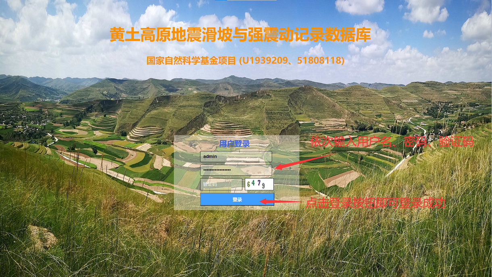
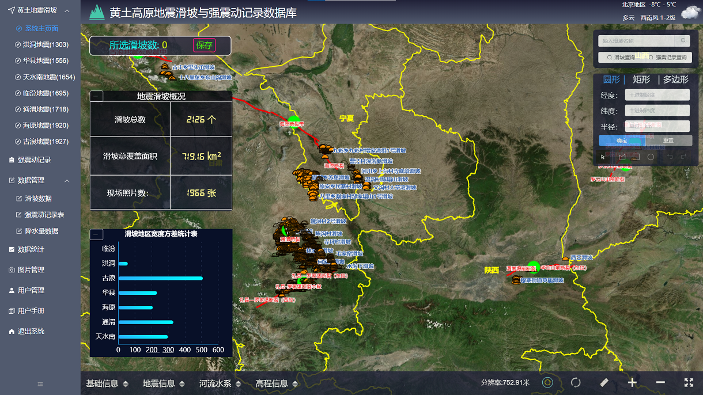
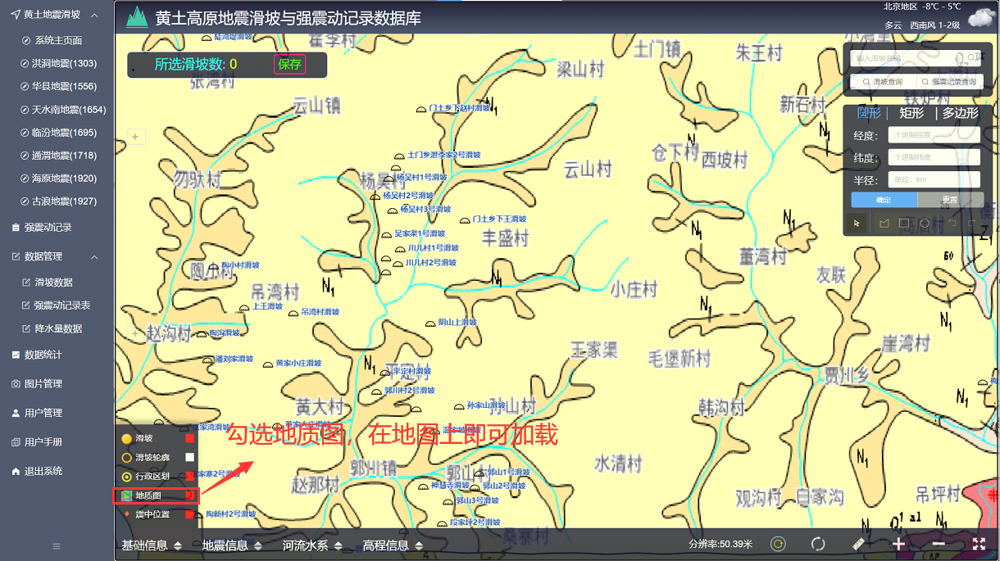
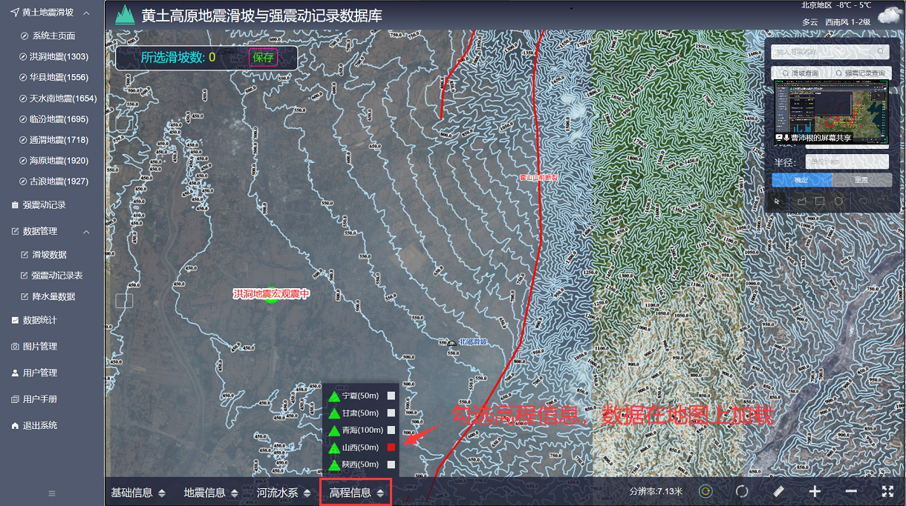
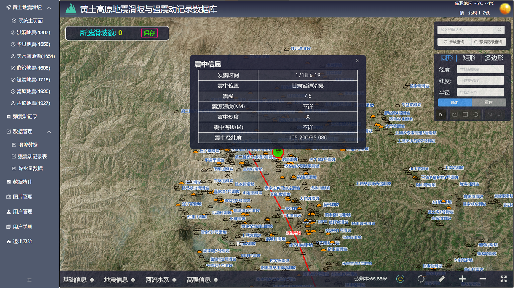
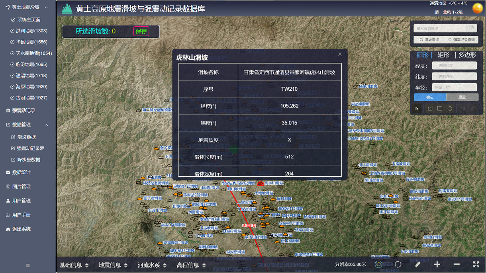
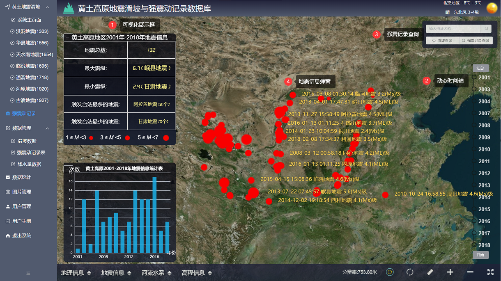
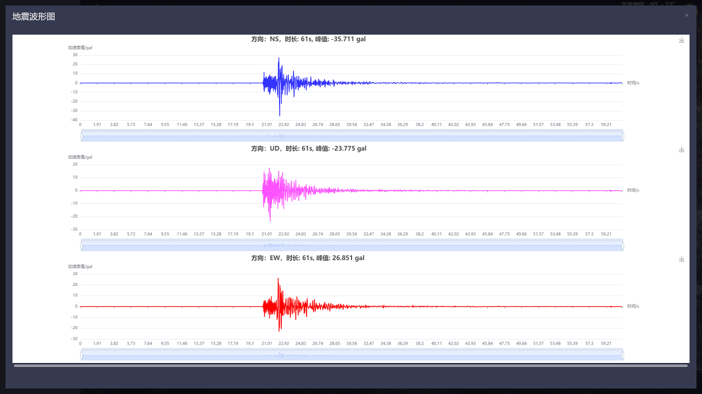
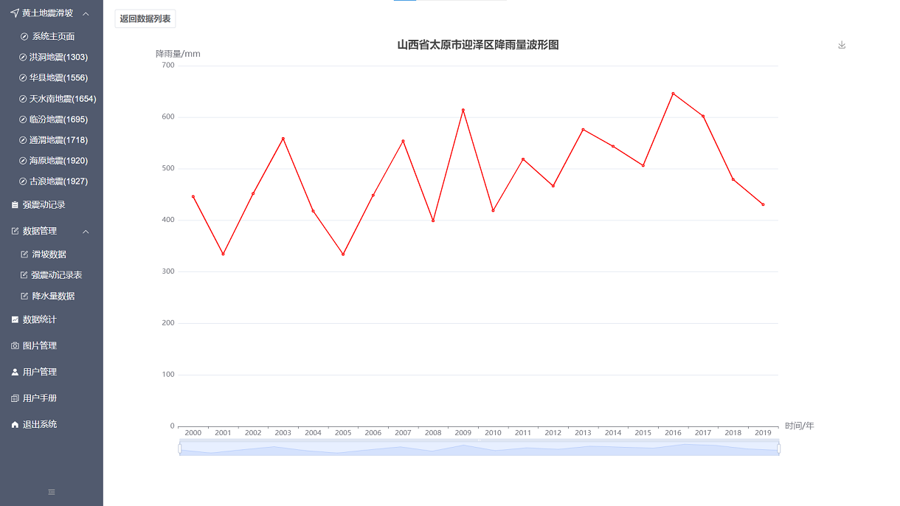
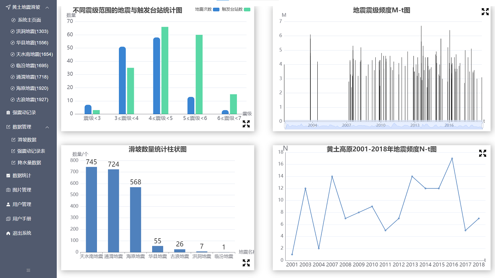
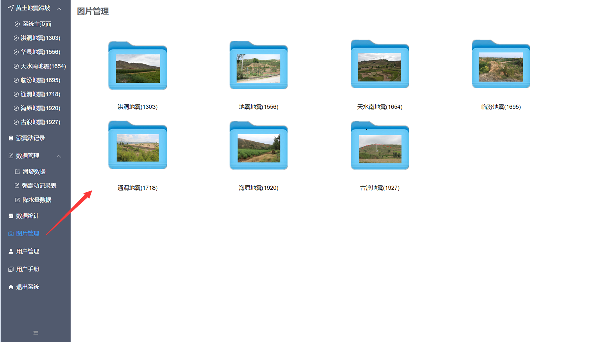
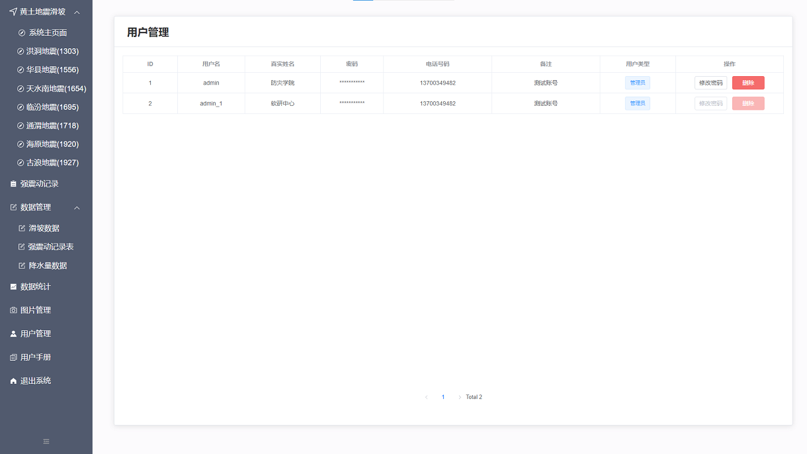
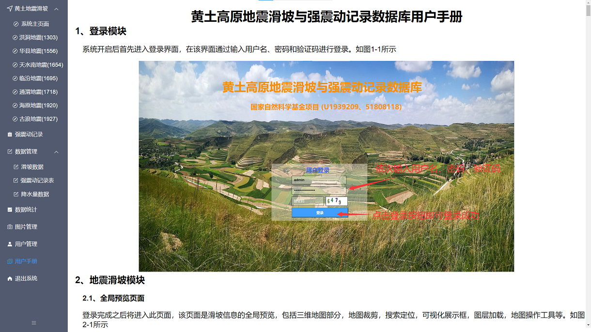

### 浏览器支持 🌎

- 本地开发推荐使用 Chrome 最新版浏览器 [Download](https://www.google.com/intl/zh-CN/chrome/)。
- 生产环境支持现代浏览器，不在支持 IE 浏览器，更多浏览器可以查看 [Can I Use Es Module](https://caniuse.com/?search=ESModule)。

|  |  |  |  |  |
| :----------------------------------------------------------: | :----------------------------------------------------------: | :----------------------------------------------------------: | :----------------------------------------------------------: | :----------------------------------------------------------: |
|                         not support                          |                       last 2 versions                        |                       last 2 versions                        |                       last 2 versions                        |                       last 2 versions                        |

